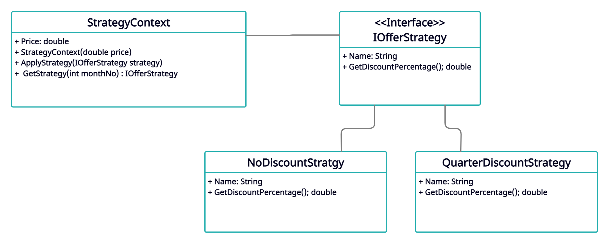

# Strategy(Offer Strategy)
This Project about defind tow Algorithm and put each of them into separate class and meke their object interchangeable, Implemented an Strategy design pattern using C#.

### UML CLASS DAIGRAM:
